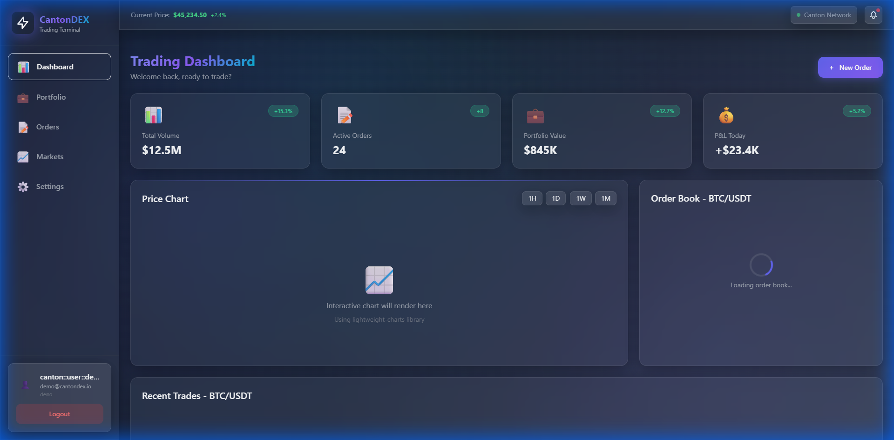
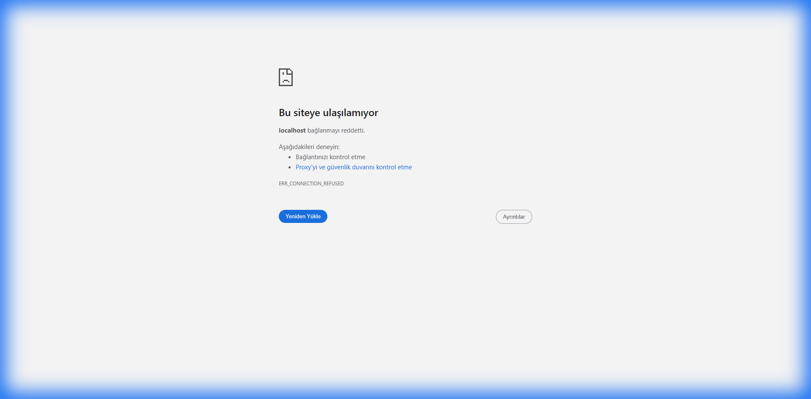

# CantonDEX - Project Prototype & Demo

**Privacy-Preserving Institutional Trading Platform on Canton Network**

## 🎥 Live Demo

### 1. End-to-End Trading Flow
This video demonstrates the complete trading lifecycle:
- **Login**: Secure authentication with Canton Party ID
- **Order Placement**: Placing a BUY order for BTC
- **Order Book**: Real-time updates
- **Execution**: Atomic matching and settlement

---

### 2. Real-Time Order Book
Live visualization of the order book with Price-Time Priority matching.
- **Green**: Bid orders (Buy)
- **Red**: Ask orders (Sell)
- **Spread**: Calculated in real-time

---

### 3. Backend API & Swagger UI
The platform is powered by a robust FastAPI backend with comprehensive documentation.
- **Endpoints**: Accounts, Orders, Trades, Market Data
- **Security**: JWT & Canton Auth
- **Database**: PostgreSQL with atomic transactions

---

## 📸 Screenshots

### Trading Dashboard
The main interface for institutional traders.

### Login Screen
Secure entry point supporting Passkey and Token authentication.

### API Documentation
Interactive Swagger UI for developers and integrators.

---

## 🚀 Key Features

1.  **Atomic DvP Settlement**: Eliminates settlement risk by executing asset transfers and payments in a single atomic transaction.
2.  **Sub-Transaction Privacy**: Order details are confidential; only matched parties know the counterparty.
3.  **Institutional Grade**: Built with DAML smart contracts and Canton Network for regulatory compliance.
4.  **High Performance**: Matching engine runs every 500ms with sub-second finality.

## 🔗 Links

- **GitHub Repository**: [https://github.com/getcakedieyoungx/cantondex](https://github.com/getcakedieyoungx/cantondex)
- **Documentation**: [docs/README.md](docs/README.md)
- **Walkthrough**: [WALKTHROUGH.md](WALKTHROUGH.md)
