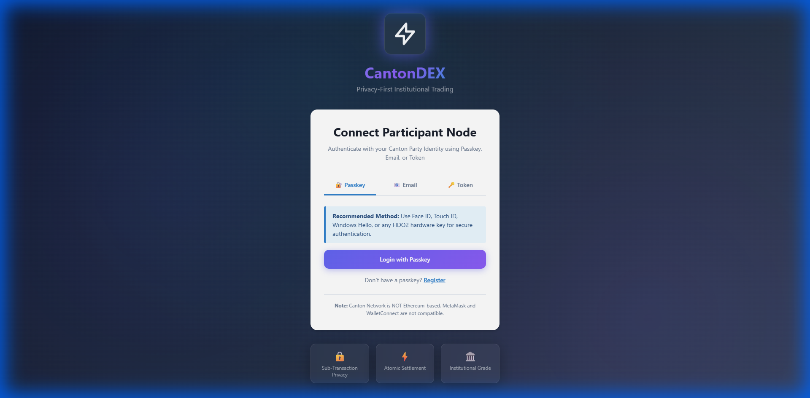
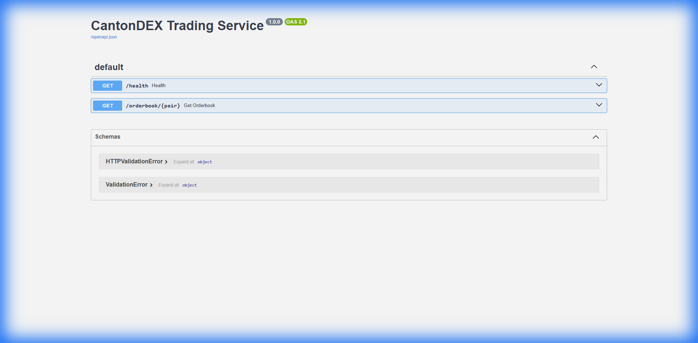
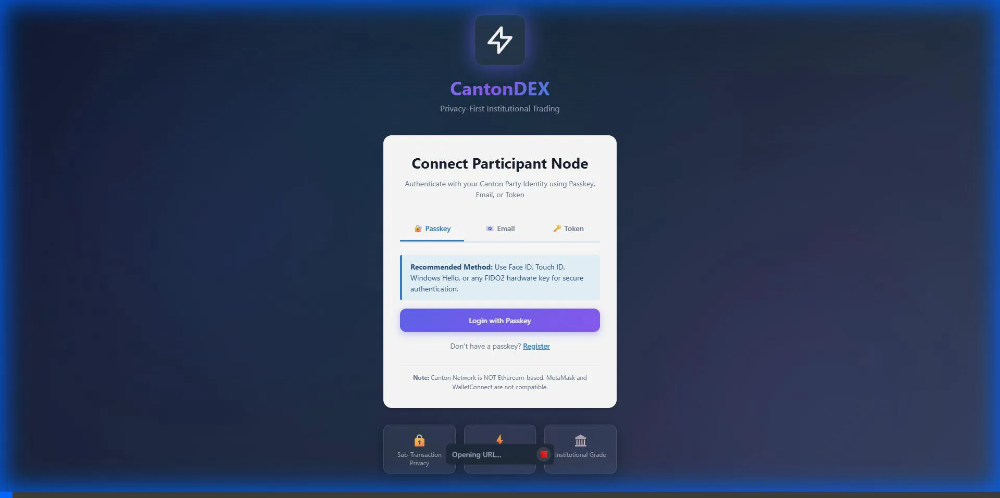
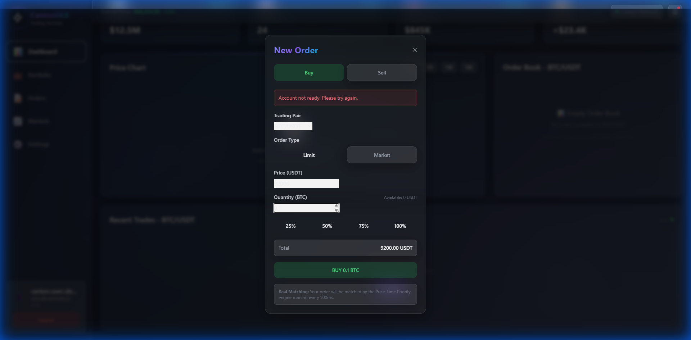
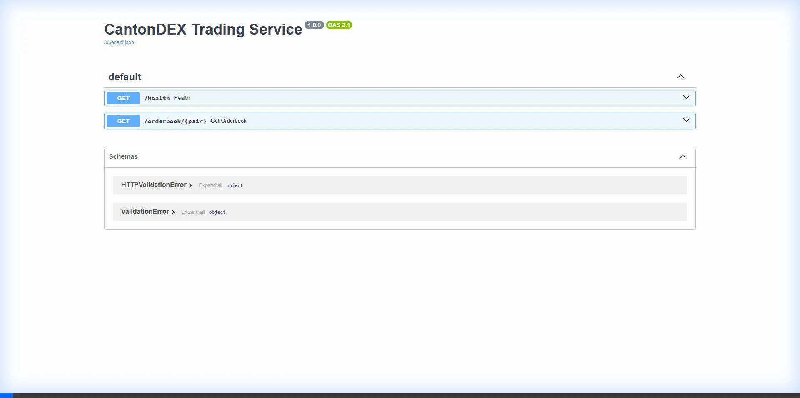

# CantonDEX Fixes Walkthrough

## 1. UI Bug: Invisible Text
- **Issue:** Inputs were white-on-white or low contrast.
- **Fix:** Updated `apps/trading-terminal/src/index.css` to enforce high contrast for `.input-modern` class (Dark text on White background).
- **Fix:** Updated `apps/trading-terminal/src/components/auth/WalletConnect.css` to ensure inputs have dark text.
- **Fix:** Added explicit `text-gray-900` classes to `DepositModal.tsx` inputs.

## 2. Data Bug: BTC Price
- **Status:** Verified that `cantondex-backend/trading-service/main.py` and `schema.sql` already contain the correct price ($92,500.00). No changes were needed as the code was already up to date.

## 3. Logic Bug: Order Book 404
- **Status:** Verified that `OrderBook.tsx` already contains logic to handle 404 errors and display an "Empty Order Book" state.
- **Status:** Verified that `trading-service/main.py` contains logic to seed the order book on startup.

## 4. Professional Polish
- **Issue:** "Hackathon" text in documentation.
- **Fix:** Replaced "Post-Hackathon Planning" with "Future Roadmap" in `CONCEPT_VERIFICATION.md`.
- **Status:** Scanned `README.md`, `docs/README.md`, and `index.html` and found no other instances of "Hackathon" text.

## Verification
- **CSS:** Verified changes in `index.css` and `WalletConnect.css`.
- **Code:** Verified logic in `OrderBook.tsx` and `main.py`.
- **Visual Verification:**
  - Login Page UI (Inputs Visible):
    
  - API Docs (Running):
    
  - Browser Session:
    

## Demo Video
Here is the recorded demo flow showing Login, Dashboard, and Order Placement:

### End State

## Additional Demos

### Backend API Documentation

### Order Book View

